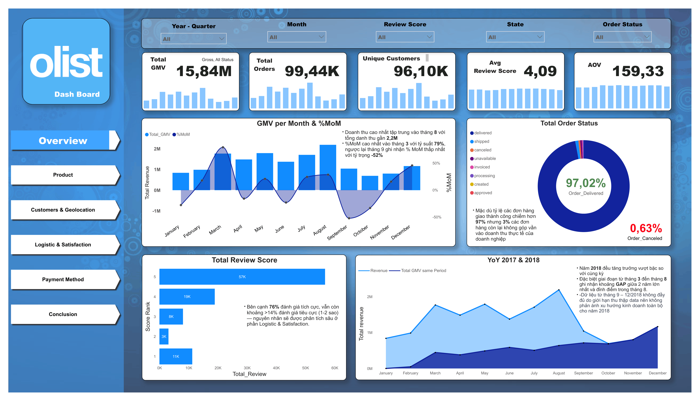
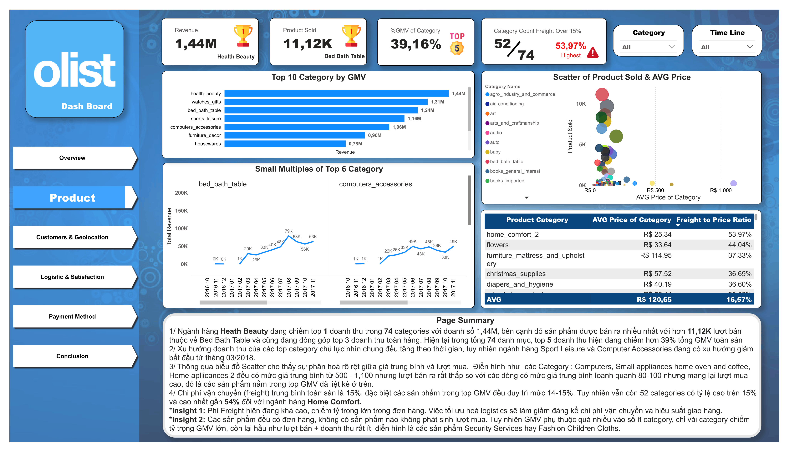
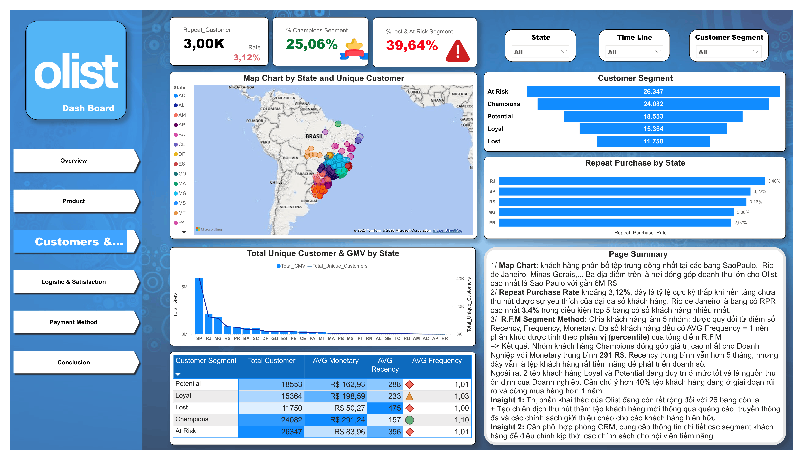
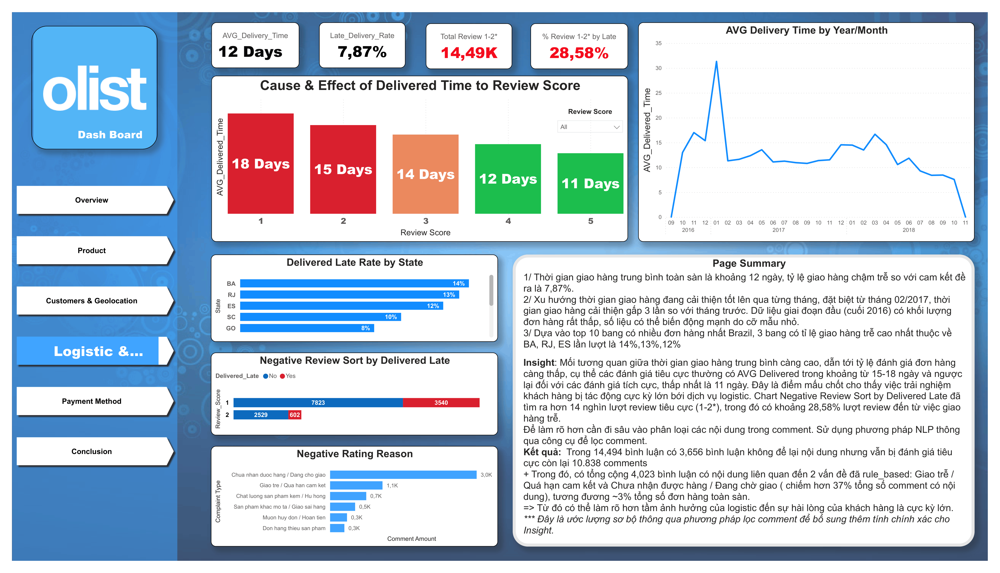
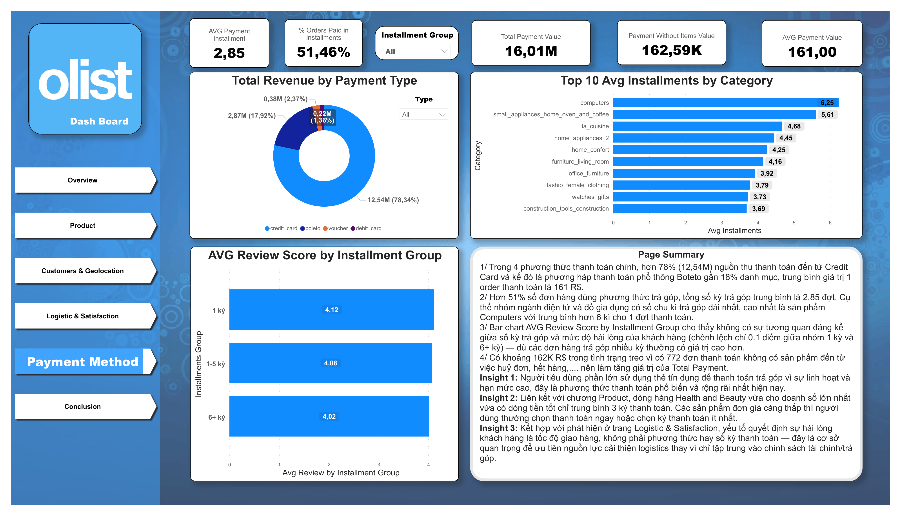
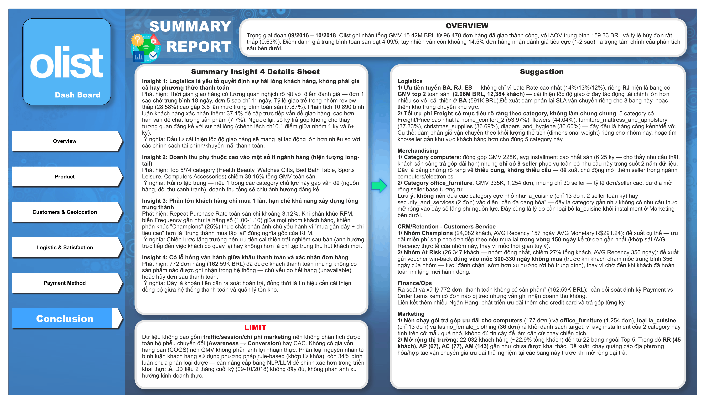

<div align="center">

# 📊 Olist Ecommerce Analytics

**Phân tích dữ liệu ecommerce end-to-end: từ 9 file CSV thô đến Dashboard Power BI có insight và đề xuất hành động cho ban lãnh đạo.**


[Xem Portfolio](https://buivietanh3.github.io/vietanh.github./) · [Tác giả: Bùi Việt Anh](https://linkedin.com/in/việt-anh-bùi-a9b6b6294)

</div>

---

## Mục lục

- [Bài toán](#bài-toán)
- [Quy trình thực hiện](#quy-trình-thực-hiện)
- [Mô hình dữ liệu](#mô-hình-dữ-liệu)
- [Dashboard — Screenshots](#dashboard--screenshots)
- [Insight chính](#insight-chính)
- [Đề xuất hành động](#đề-xuất-hành-động)
- [Hạn chế](#hạn-chế)
- [Cấu trúc repo](#cấu-trúc-repo)
- [Tài liệu đầy đủ](#tài-liệu-đầy-đủ)
- [Liên hệ](#liên-hệ)

---

## Bài toán

Olist là sàn thương mại điện tử tại Brazil. Dữ liệu công khai (Olist Brazilian E-Commerce Public Dataset) ghi nhận ~100.000 đơn hàng trong giai đoạn 09/2016 – 10/2018, gồm 9 file CSV rời rạc, chưa qua xử lý, chưa có mô hình dữ liệu hay công cụ trực quan hóa.

**Câu hỏi cốt lõi:** Điều gì đang thực sự diễn ra trên sàn Olist, và đâu là những vấn đề then chốt ảnh hưởng đến doanh thu cũng như sự hài lòng của khách hàng — để từ đó đề xuất hành động cải thiện cụ thể cho từng bộ phận?

📄 Xem chi tiết: [Phát biểu bài toán](docs/01_Phat_bieu_bai_toan.docx)

## Quy trình thực hiện

```
9 File CSV thô  →  Python (EDA)  →  BigQuery (ETL/SQL)  →  Star Schema  →  Power BI (DAX + Dashboard)
```

| Giai đoạn | Công cụ | Việc đã làm |
|---|---|---|
| Khám phá dữ liệu | Python (pandas) | Kiểm tra chất lượng dữ liệu ban đầu, định hướng khung phân tích |
| **Extract & Load** | Python (`google-cloud-bigquery`) | Đẩy 9 file CSV thô (~1.3 triệu dòng) từ local lên BigQuery |
| **Transform (ETL)** | Google BigQuery (SQL) | Làm sạch, khử trùng lặp, chuẩn hóa khóa, xử lý null theo đúng ngữ cảnh nghiệp vụ |
| Mô hình hóa | BigQuery → Power BI | Thiết kế Star Schema chuẩn Kimball (5 Dimension + 4 Fact) |
| Phân tích & Trực quan hóa | Power BI (DAX) | 30+ DAX measure, RFM Segmentation, Dashboard 6 trang, Auto-refresh hằng ngày |

📄 Code đẩy dữ liệu lên BigQuery: [`python/load_csv_to_bigquery.py`](python/load_csv_to_bigquery.py)
📄 Code SQL transform đầy đủ: [`sql/etl_bigquery.sql`](sql/etl_bigquery.sql)

## Mô hình dữ liệu

**Star Schema — 5 Dimension + 4 Fact, 0% lỗi tham chiếu (referential integrity)**

| Bảng | Loại | Grain |
|---|---|---|
| `dim_customers` | Dimension | 1 dòng / customer_id |
| `dim_products` | Dimension | 1 dòng / product_id |
| `dim_sellers` | Dimension | 1 dòng / seller_id |
| `dim_geolocation` | Dimension | 1 dòng / zip code (đã dedupe từ 1,000,163 → 19,015 dòng) |
| `dim_date` | Dimension | 1 dòng / ngày lịch |
| `fact_orders` | Fact | 1 dòng / đơn hàng (99,441 đơn) |
| `fact_order_items` | Fact | 1 dòng / sản phẩm trong đơn (112,650 dòng) |
| `fact_payments` | Fact | 1 dòng / lượt thanh toán |
| `fact_reviews` | Fact | 1 dòng / đơn (đã khử trùng review) |

⚠️ **Bẫy dữ liệu quan trọng nhất phát hiện được:** `customer_id` là khóa theo **đơn hàng**, không phải khách hàng thật — mọi phép đo Repeat Rate/CLV bắt buộc dùng `customer_unique_id`.

📄 Chi tiết đầy đủ từng cột: [`docs/02_Data_Dictionary_Olist.xlsx`](docs/02_Data_Dictionary_Olist.xlsx)

## Dashboard — Screenshots

Dashboard Power BI tương tác **6 trang**, mỗi trang trả lời 1 nhóm câu hỏi kinh doanh cụ thể (xem đầy đủ bộ câu hỏi thiết kế tại [`docs/03_Bo_cau_hoi_phan_tich.docx`](docs/03_Bo_cau_hoi_phan_tich.docx)).

### 1. Overview — Bức tranh tổng thể


### 2. Product — Hiệu suất ngành hàng


### 3. Customer & Geolocation — Chân dung khách hàng (RFM Segmentation)


### 4. Logistic & Satisfaction — Insight trọng tâm của toàn dự án


### 5. Payment Method — Hành vi thanh toán


### 6. Conclusion — Tổng hợp insight & đề xuất hành động


📁 File Power BI đầy đủ (tương tác được, cần Power BI Desktop): [`power-bi/Olist_Dashboard_FULL.pbix`](power-bi/Olist_Dashboard_FULL.pbix)
📄 Xem nhanh cả 6 trang ngay trên trình duyệt (không cần cài gì): [`power-bi/Olist_Dashboard_Export.pdf`](power-bi/Olist_Dashboard_Export.pdf)

## Insight chính

**1. Logistics là yếu tố quyết định sự hài lòng khách hàng — không phải giá cả hay phương thức thanh toán**
Đơn hàng bị đánh giá 1 sao chờ giao trung bình **18 ngày**, trong khi đơn 5 sao chỉ **11 ngày**. Tỷ lệ giao trễ trong nhóm review thấp cao gấp **3.6 lần** mức trung bình toàn sàn. Phân tích 10,890 bình luận khách hàng (rule-based text classification) xác nhận thêm: **37.1%** bình luận tiêu cực đề cập trực tiếp vấn đề giao hàng — cao hơn hẳn vấn đề chất lượng sản phẩm (7.7%). Ngược lại, số kỳ trả góp **không** cho thấy tương quan đáng kể với sự hài lòng.

**2. Doanh thu phụ thuộc cao vào một số ít ngành hàng (hiện tượng long-tail)**
Top 5/74 category (Health Beauty, Watches Gifts, Bed Bath Table, Sports Leisure, Computers Accessories) chiếm **39.16%** tổng GMV toàn sàn — rủi ro tập trung nếu 1 trong các category này gặp vấn đề nguồn hàng.

**3. Phần lớn khách hàng chỉ mua 1 lần**
Repeat Purchase Rate toàn sàn chỉ **3.12%**. Phân khúc RFM cho thấy biến Frequency gần như là hằng số giữa các nhóm khách hàng — chiến lược tăng trưởng nên ưu tiên cải thiện trải nghiệm sau bán hơn là chỉ tập trung thu hút khách mới.

**4. Lỗ hổng vận hành giữa khâu thanh toán và xác nhận đơn hàng**
772 đơn hàng (162.59K BRL) đã được khách thanh toán nhưng không có sản phẩm nào được ghi nhận trong hệ thống — chủ yếu do hết hàng hoặc hủy đơn sau thanh toán, cần rà soát hoàn tiền.

## Đề xuất hành động

| Phòng ban | Đề xuất cụ thể |
|---|---|
| **Logistics** | Ưu tiên cải thiện tốc độ giao ở 3 bang có Late Rate cao nhất (BA 14%, RJ 13%, ES 12%); đàm phán lại phí Freight cho nhóm category cồng kềnh (home_comfort_2, furniture_mattress...) |
| **Merchandising** | Mở rộng seller cho category `computers` (avg installment cao nhất sàn nhưng chỉ 9 seller phục vụ) và `office_furniture` — bằng chứng thiếu cung, không thiếu cầu |
| **CRM/Retention** | Ưu đãi miễn phí ship cho Champions (24,082 khách) trong 150 ngày kể từ đơn gần nhất; chiến dịch win-back cho nhóm At Risk (26,347 khách) trước mốc 330 ngày không mua |
| **Finance/Ops** | Rà soát và xử lý 772 đơn "thanh toán không có sản phẩm"; đối soát định kỳ Payment vs Order Items |
| **Marketing** | Mở rộng thị trường tại các bang gần như chưa khai thác (RR, AP, AC, AM — dưới 150 khách hàng mỗi bang) |

📄 Chi tiết đầy đủ + bằng chứng số liệu: xem trang Conclusion trong Dashboard hoặc [`docs/08_Presentation.pptx`](docs/08_Presentation.pptx)

## Hạn chế

- Không có dữ liệu traffic/session/chi phí marketing → không phân tích được phễu chuyển đổi (Awareness → Conversion) hay CAC
- Không có giá vốn hàng bán (COGS) → GMV phản ánh doanh thu gộp, không phải lợi nhuận thực
- Phân loại nguyên nhân từ bình luận khách hàng dùng phương pháp rule-based (khớp từ khóa) — 34% bình luận chưa phân loại được, cần nâng cấp bằng NLP/LLM để chính xác hơn khi triển khai thực tế
- Dữ liệu 2 tháng cuối kỳ (09–10/2018) không đầy đủ, không phản ánh đúng xu hướng kinh doanh thực

## Cấu trúc repo

```
olist-ecommerce-analytics/
├── README.md
├── python/
│   └── load_csv_to_bigquery.py      ← Đẩy 9 CSV thô lên BigQuery (Extract-Load)
├── sql/
│   └── etl_bigquery.sql             ← Làm sạch/transform dữ liệu (chạy trong BigQuery)
├── docs/
│   ├── 01_Phat_bieu_bai_toan.docx
│   ├── 02_Data_Dictionary_Olist.xlsx
│   ├── 03_Bo_cau_hoi_phan_tich.docx
│   └── 08_Presentation.pptx
├── dashboard-screenshots/
│   ├── 01-overview.png
│   ├── 02-product.png
│   ├── 03-customer.png
│   ├── 04-logistic.png
│   ├── 05-payment.png
│   └── 06-conclusion.png
└── power-bi/
    ├── Olist_Dashboard_FULL.pbix        ← File gốc, mở bằng Power BI Desktop
    └── Olist_Dashboard_Export.pdf       ← Xem nhanh 6 trang, không cần cài gì
```

**Vì sao tách `python/` và `sql/` thành 2 thư mục riêng?** Đây là 2 giai đoạn khác nhau trong pipeline: `python/` phụ trách **Extract & Load** (đưa dữ liệu thô từ máy local lên BigQuery), còn `sql/` phụ trách **Transform** (làm sạch, chuẩn hóa ngay trên BigQuery) — tách riêng giúp người xem code hiểu ngay đâu là bước nào trong quy trình ETL/ELT.

## Tài liệu đầy đủ

| Tài liệu | Nội dung |
|---|---|
| [01_Phat_bieu_bai_toan.docx](docs/01_Phat_bieu_bai_toan.docx) | Bối cảnh, mục tiêu, phạm vi dự án |
| [02_Data_Dictionary_Olist.xlsx](docs/02_Data_Dictionary_Olist.xlsx) | Mô tả chi tiết từng bảng/cột + code SQL |
| [03_Bo_cau_hoi_phan_tich.docx](docs/03_Bo_cau_hoi_phan_tich.docx) | Khung câu hỏi phân tích cho từng trang Dashboard |
| [08_Presentation.pptx](docs/08_Presentation.pptx) | Slide thuyết trình kết quả cho stakeholder |


## Liên hệ

**Bùi Việt Anh** — Junior Data Analyst
📧 buivietanh3@gmail.com · 💼 [LinkedIn](https://linkedin.com/in/việt-anh-bùi-a9b6b6294) · 🌐 [Portfolio](https://buivietanh3.github.io/vietanh.github./)

